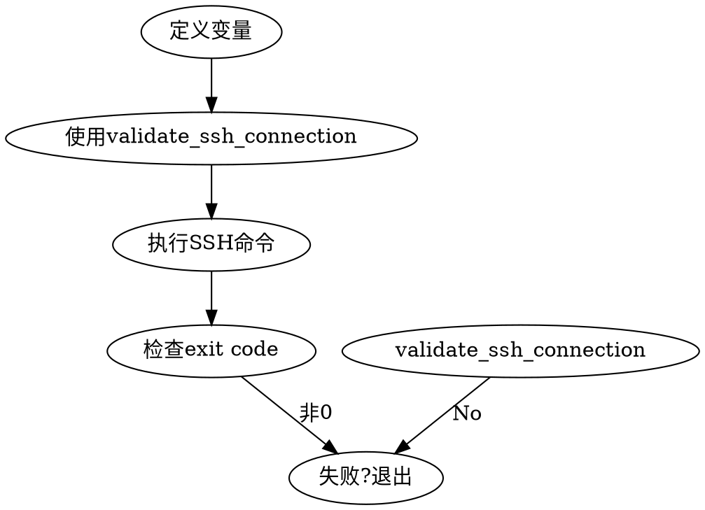

# Production SSH Skill - 快速开始

## 📖 概述

`production-ssh` skill为SevenKitchen项目提供标准化的SSH操作规范。所有连接到生产服务器的操作都必须遵循此skill的规则。

## 🎯 适用场景

- 连接到生产/测试服务器
- 执行远程部署脚本
- 查看生产日志或服务状态
- 在远程服务器上运行数据库迁移
- 传输文件到/从生产服务器

## 🚀 快速开始

### 1. 查看生产服务日志

```bash
# 使用production-ssh skill生成标准脚本
# Skill会确保：
# - SSH连接测试
# - 错误处理
# - Exit code检查
```

### 2. 远程部署

```bash
# backend/scripts/remote_deploy.sh 遵循此skill
# 部署前会自动验证SSH连接
```

## 📋 必须遵循的规则

### ✅ 正确做法

```bash
# 1. 定义变量
SSH_KEY_PATH="$HOME/.ssh/claude_deploy"
SERVER_USER="root"
SERVER_HOST="1.14.3.2"

# 2. 使用validate_ssh_connection函数
validate_ssh_connection "$SSH_KEY_PATH" "$SERVER_USER" "$SERVER_HOST" || exit 1

# 3. 执行SSH命令（带错误处理）
ssh -i "$SSH_KEY_PATH" -o StrictHostKeyChecking=no \
    "$SERVER_USER@$SERVER_HOST" \
    "command" || { echo "Failed"; exit 1; }

# 4. 检查exit code
if [ $? -eq 0 ]; then
  echo "✓ Success"
else
  echo "✗ Failed"
  exit 1
fi
```

### ❌ 错误做法

```bash
# 不要这样做：
ssh root@1.14.3.2 "command"  # 缺少所有安全检查
```

## 🔧 服务器配置

**生产服务器：**
- Host: `1.14.3.2`
- User: `root`
- SSH Key: `~/.ssh/claude_deploy`
- Project Path: `/opt/sevenkitchen/SevenKitchen/backend`

## 📚 相关文档

- **完整的skill文档**: `skills/production-ssh/SKILL.md`
- **部署脚本示例**: `backend/scripts/remote_deploy.sh`
- **项目文档**: `docs/`

## 🛡️ 安全提示

1. **使用专用部署密钥**：不要使用个人SSH密钥
2. **验证后再操作**：所有SSH操作前必须测试连接
3. **检查退出码**：确保命令执行成功
4. **错误处理**：使用`set -euo pipefail`

## 🔄 典型工作流程



## 💡 常用命令

| 任务 | 命令模式 |
|------|---------|
| 查看服务状态 | `ssh -i "$KEY" $USER@$HOST "systemctl status service"` |
| 查看日志 | `ssh -i "$KEY" $USER@$HOST "journalctl -u service -n 100"` |
| 重启服务 | `ssh -i "$KEY" $USER@$HOST "systemctl restart service"` |
| 传输文件 | `scp -i "$KEY" local-file $USER@$HOST:/remote/path/` |

---

**记住**：所有SSH操作都应该遵循`production-ssh` skill的规范。当你需要连接到生产服务器时，请参考skill文档中的完整模式。
