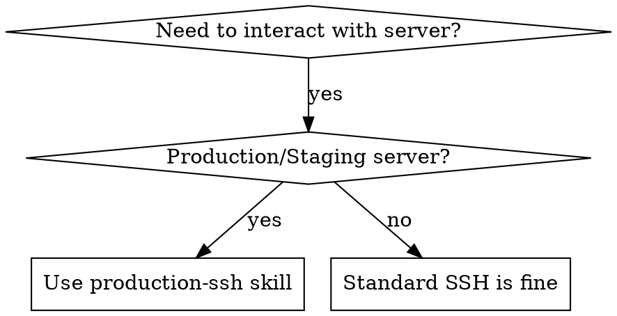

# Production SSH Operations

## Overview
Secure and standardized SSH operations for production servers. **Always use the `validate_ssh_connection` function before any SSH operations, check exit codes after execution, and never skip connection testing.**

## When to Use



**Use when:**
- Connecting to production/staging servers
- Executing remote deployment scripts
- Viewing production logs or service status
- Running database migrations on remote servers
- Transferring files to/from production servers

**NOT for:**
- Local development environment operations
- SSH to personal/development machines
- Non-production testing environments

## Core Pattern

### ❌ Before (Unsafe)
```bash
# No validation, no error handling
ssh root@1.14.3.2 "systemctl restart service"

# No connection test, no variables, no error handling
scp file.tar.gz root@1.14.3.2:/opt/app/

# Manual checks instead of using validate_ssh_connection
if [ ! -f ~/.ssh/claude_deploy ]; then
  echo "Key not found"
  exit 1
fi
ssh root@1.14.3.2 "echo test"  # Missing -i flag, timeout, error handling
```

### ✅ After (Safe)
```bash
# 1. Define variables (ALWAYS at the top)
SSH_KEY_PATH="$HOME/.ssh/claude_deploy"
SERVER_USER="root"
SERVER_HOST="1.14.3.2"

# 2. Use validate_ssh_connection function (MANDATORY)
validate_ssh_connection "$SSH_KEY_PATH" "$SERVER_USER" "$SERVER_HOST" || exit 1

# 3. Execute remote command with error handling
ssh -i "$SSH_KEY_PATH" -o StrictHostKeyChecking=no \
    "$SERVER_USER@$SERVER_HOST" \
    "systemctl restart sevenkitchen-backend" || {
      echo "ERROR: Failed to restart service"
      exit 1
    }

# 4. Check exit code (MANDATORY for critical operations)
if [ $? -eq 0 ]; then
  echo "✓ Service restarted successfully"
else
  echo "✗ Service restart failed"
  exit 1
fi
```

## Quick Reference

| Task | Command Pattern |
|------|----------------|
| **Test connection** | `ssh -i "$KEY" -o ConnectTimeout=10 -o StrictHostKeyChecking=no $USER@$HOST "echo test"` |
| **Execute single command** | `ssh -i "$KEY" -o StrictHostKeyChecking=no $USER@$HOST "command" || { echo "Failed"; exit 1; }` |
| **Execute multiple commands** | Use heredoc (see Implementation) |
| **View service status** | `ssh -i "$KEY" $USER@$HOST "systemctl status service-name"` |
| **View logs (live)** | `ssh -i "$KEY" $USER@$HOST "journalctl -u service-name -f"` |
| **Transfer files (upload)** | `scp -i "$KEY" local-file $USER@$HOST:/remote/path/` |
| **Transfer files (download)** | `scp -i "$KEY" $USER@$HOST:/remote/file local-path/` |

## Implementation

### Standard SSH Variables

```bash
# Server configuration
SERVER_HOST="1.14.3.2"              # Production server IP
SERVER_USER="root"                  # SSH user
SSH_KEY_PATH="$HOME/.ssh/claude_deploy"  # SSH private key
SERVER_PROJECT_PATH="/opt/sevenkitchen/SevenKitchen/backend"
```

### MANDATORY: Pre-flight Validation Function

**CRITICAL: Every SSH operation MUST use this function. No exceptions.**

```bash
validate_ssh_connection() {
  local key_path="$1"
  local user="$2"
  local host="$3"

  # Check SSH key exists
  if [ ! -f "$key_path" ]; then
    echo "ERROR: SSH key not found: $key_path"
    echo "Please generate one with: ssh-keygen -t ed25519 -C 'deploy' -f ~/.ssh/claude_deploy"
    return 1
  fi

  # Test SSH connection
  if ! ssh -i "$key_path" -o ConnectTimeout=10 -o StrictHostKeyChecking=no \
      "$user@$host" "echo 'Connection test successful'" >/dev/null 2>&1; then
    echo "ERROR: SSH connection test failed to $user@$host"
    echo "Please check:"
    echo "  1. Server is accessible"
    echo "  2. SSH key is properly configured on server"
    echo "  3. Firewall allows SSH (port 22)"
    return 1
  fi

  echo "✓ SSH connection validated"
  return 0
}

# MANDATORY: Call this before ANY SSH operation
validate_ssh_connection "$SSH_KEY_PATH" "$SERVER_USER" "$SERVER_HOST" || exit 1
```

**Common rationalizations to AVOID:**
- "This is just a quick check" → Use the function
- "I already tested the connection manually" → Use the function
- "The connection is always reliable" → Use the function
- "I'll add error handling later" → Use the function NOW

### Remote Command Execution (Heredoc)

```bash
# For multiple commands or complex scripts
ssh -i "$SSH_KEY_PATH" -o StrictHostKeyChecking=no \
    "$SERVER_USER@$SERVER_HOST" \
    "export SERVER_PROJECT_PATH=\"$SERVER_PROJECT_PATH\" && bash -s" << 'ENDSSH'
set -euo pipefail  # Exit on error, undefined variables, pipe failures

# Change directory
cd "${SERVER_PROJECT_PATH:?SERVER_PROJECT_PATH not set}"

# Your commands here
echo "Current directory: $(pwd)"
git pull origin main
npm install --production
systemctl restart sevenkitchen-backend

# Verify result
if systemctl is-active --quiet sevenkitchen-backend; then
  echo "✓ Service restarted successfully"
else
  echo "✗ Service failed to start"
  exit 1
fi
ENDSSH

# Check exit code
if [ $? -eq 0 ]; then
  echo "✓ Remote execution completed"
else
  echo "✗ Remote execution failed"
  exit 1
fi
```

### Common Remote Operations

```bash
# View service status
ssh -i "$SSH_KEY_PATH" "$SERVER_USER@$SERVER_HOST" \
  "systemctl status sevenkitchen-backend"

# View recent logs (last 100 lines)
ssh -i "$SSH_KEY_PATH" "$SERVER_USER@$SERVER_HOST" \
  "journalctl -u sevenkitchen-backend -n 100 --no-pager"

# Follow logs (live tail)
ssh -i "$SSH_KEY_PATH" "$SERVER_USER@$SERVER_HOST" \
  "journalctl -u sevenkitchen-backend -f"

# Check disk space
ssh -i "$SSH_KEY_PATH" "$SERVER_USER@$SERVER_HOST" \
  "df -h | grep -E '(Filesystem|/$)'"

# Check memory usage
ssh -i "$SSH_KEY_PATH" "$SERVER_USER@$SERVER_HOST" \
  "free -h"

# Restart service
ssh -i "$SSH_KEY_PATH" "$SERVER_USER@$SERVER_HOST" \
  "systemctl restart sevenkitchen-backend" && \
  echo "✓ Service restarted" || \
  echo "✗ Failed to restart service"

# Check PostgreSQL status
ssh -i "$SSH_KEY_PATH" "$SERVER_USER@$SERVER_HOST" \
  "systemctl status postgresql"
```

## Common Mistakes

| Mistake | Why Bad | Fix |
|---------|---------|-----|
| **No connection test** | Command fails silently, hard to debug | Always test connection first |
| **Hardcoded server info** | Can't update, prone to errors | Use variables at script top |
| **No error handling** | Continues on failure, corrupts state | Check exit codes, use `set -euo pipefail` |
| **Missing StrictHostKeyChecking** | Prompts block automation | Use `-o StrictHostKeyChecking=no` |
| **No timeout set** | Hangs forever on network issues | Use `-o ConnectTimeout=10` |
| **Using wrong SSH key** | Authentication fails | Explicitly specify `-i key_path` |
| **No heredoc for multi-line** | Escaping nightmare, hard to read | Use heredoc with `<< 'ENDSSH'` |
| **Forgetting to check result** | Don't know if command succeeded | Check `$?` after SSH command |

## Security Checklist

Before SSH'ing to production:

- [ ] Using dedicated deploy key (not personal SSH key)
- [ ] SSH key has proper permissions (`chmod 600 ~/.ssh/claude_deploy`)
- [ ] Server is production/staging (not development)
- [ ] Command is read-only or has been tested elsewhere
- [ ] Connection will be validated before execution
- [ ] Error handling is in place
- [ ] Exit codes will be checked
- [ ] Sensitive data not in command history (use `set +o history` if needed)

## Red Flags - STOP and Fix

**Violating the letter of these rules is violating the spirit of the rules.**

- SSH command without `-i` flag → Wrong key might be used
- No `ConnectTimeout` option → Might hang forever
- Not testing connection first → Will fail in production
- Not using `validate_ssh_connection` function → Reinventing the wheel, missing checks
- No error handling (`|| { echo; exit 1; }`) → Continues on failure
- Not checking exit code (`$?`) after critical operations → Don't know if it succeeded
- Hardcoded server info in commands → Can't maintain, error-prone
- Missing `set -euo pipefail` in heredoc → Silent failures
- Writing manual checks instead of using function → Code duplication, inconsistencies

**All of these mean: Stop and fix before executing.**

## Rationalization Table

| Excuse | Reality |
|--------|---------|
| "This is just a quick command" | Quick commands fail too. Use the function. |
| "I tested the connection manually earlier" | Automation must be self-contained. Use the function. |
| "The server never has connectivity issues" | Network issues happen. Always test. |
| "Error handling makes the script too long" | Short broken scripts > long working scripts. |
| "I understand the spirit, so I can skip the formality" | Following spirit ≠ following rules. Use the function. |
| "I'll add validation later" | Later never comes. Do it now. |
| "This is read-only, so it doesn't matter" | Read operations fail too and block automation. |

## Real-World Impact

**Before this skill:**
- SSH commands fail silently in production
- Developers forget to test connections, leading to failed deployments
- Wrong SSH keys used, authentication errors
- Commands hang without timeout, blocking automation
- No error handling, cascading failures

**After this skill:**
- All SSH connections validated before execution
- Consistent error handling across all scripts
- Deployments succeed or fail fast with clear messages
- Easy to maintain with centralized configuration
- Production issues resolved faster with reliable remote access
