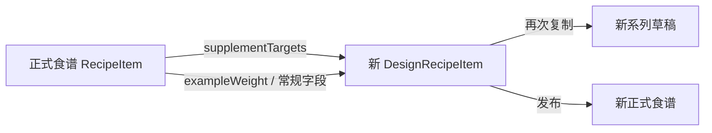

# 食谱系列复制保留补剂目标设计

## 背景

生产环境中，“兔里脊大米土豆”的低运动量成犬/老年犬阶段复制为新系列后，除洋车前子壳粉外的补剂默认用量显示为零。

已确认的事实：

- 最新正式食谱版本将多个补剂的默认目标保存于 `recipe_item.supplement_targets` JSON，例如鱼肝油的维生素 D、骨粉的磷、碳酸钙粉的钙。
- `design_recipe_item` 没有等价字段，因此设计器草稿无法保存这些多目标数据。
- 系列复制在同一阶段存在设计草稿时优先选择该草稿；旧草稿保留的补剂重量大多为零，导致它覆盖了最新正式食谱的可用目标数据。
- 洋车前子壳粉是固定重量型补剂，旧草稿中已经有 `weightG = 0.150150...`，故成为唯一非零例外；它并不拥有正式食谱的动态 `supplementTargets`。

本次只修复未来的复制行为；不回填、不修改历史副本或已发布食谱。

## 目标

1. 从食谱系列复制任一生命阶段时，以该阶段最新可复制的正式食谱为数据源，只在没有正式食谱时回退到设计草稿。
2. 让设计草稿明细能持久化正式食谱的全部 `supplementTargets`，包含一个补剂对应多个营养目标的场景。
3. 对只有动态目标、没有固定克数的补剂，按源正式食谱的食材总重与补剂浓度计算新草稿的初始用量，避免编辑器显示为零。
4. 新副本在重新打开、再次复制、编辑并发布后都不丢失补剂目标。
5. 保持无补剂目标的固定重量补剂（如洋车前子壳粉）现有的重量复制行为。

## 非目标

- 不修复已创建的副本。
- 不给历史设计草稿反向推导或回填补剂目标。
- 不改变营养评估算法、补剂浓度计算或正式食谱的发布格式。
- 不改变同系列内“从一个设计草稿复制原料到另一个草稿”的操作；该操作没有正式食谱版本选择语义。

## 方案

### 数据模型

在 `DesignRecipeItem` 添加可空 JSON 列 `supplementTargets`，数据库列名为 `supplement_targets`。其结构与 `RecipeItem.supplementTargets` 相同：

```ts
type SupplementTarget = {
  fieldPath: string;
  label: string;
  targetValuePerKg: number;
  unit: string;
};
```

可空值代表历史草稿或没有动态补剂目标。空数组表示已明确没有目标；复制路径按源数据原样保留 `null`、`[]` 或目标数组。迁移只新增可空列，不更新已有记录。

### 复制源选择

`getLatestCopyableSeriesStageSources` 对每个生命阶段改为：

1. 查找符合现有发布状态优先级、版本号和更新时间规则的最新正式食谱；若存在，返回 `kind: 'recipe'`。
2. 若不存在可复制的正式食谱，回退至该阶段最新设计草稿，返回 `kind: 'design'`。
3. 两者均不存在时，该阶段不出现在可复制来源中。

这避免旧草稿盖过已经发布的、包含最新补剂目标的正式版本，同时仍允许纯草稿系列继续复制。

### 数据流



从正式食谱转换为设计明细时，除现有 `ingredientId`、`nutritionFoodId`、比例、制备方式、旧式单目标字段和排序外，新增复制 `supplementTargets`。转换同时按下列顺序确定设计器的 `weightG`：

1. 食材继续使用 `exampleWeight`（没有时沿用现有比例回退）。
2. 没有 `supplementTargets` 的补剂继续使用 `exampleWeight`，因此固定重量型洋车前子壳粉行为不变。
3. 有有效 `supplementTargets` 的补剂使用共享的 `calculateSupplementDose` 计算：以复制后食材的总克数为基数、补剂营养档案浓度为分母、目标数组中需求量最大的目标为限制条件，不计生产损耗。该结果写入 `weightG`。
4. 若目标无效或补剂浓度缺失，回退到 `exampleWeight`，再回退到现有的零值逻辑；复制不能因单个历史补剂档案不完整而失败。

为支持这一步，加载正式食谱复制源时要选择补剂原料的 `type`、`nutritionProfile` 和展示单位。剂量计算复用后端已有的 `domain/ingredient/supplement-targets.ts`，不在复制服务或前端复制另一套浓度换算公式。

从设计草稿复制时，`toCopiedDesignRecipeItemData` 同样复制该字段，确保新草稿、系列副本、修订草稿和同系列原料复制都不会丢失数据。

设计器的读取类型和 `DESIGN_RECIPE_INCLUDE` 必须选择此字段。发布时，正式食谱补剂目标的生成规则保持不变：新鲜营养评估计算出的目标优先；没有重新计算出的目标时，可以保留草稿已存目标作为回退，避免仅编辑非营养字段后发布时清空数据。

### 兼容与错误处理

- 历史设计草稿中该列为 `null` 时，所有读取与复制路径正常工作。
- 没有正式食谱的阶段继续从最新设计草稿复制。
- 正式食谱的补剂明细若 `supplementTargets` 为 `null` 或空数组，按原值复制；固定重量仍按 `exampleWeight` 逻辑处理。
- 复制时不计算补剂新用量；它只保留可供编辑器与后续发布使用的目标数据。

## 测试与验收

在 `recipe-designer.service` 单元测试中新增或扩展下列用例：

1. 同阶段同时存在旧设计草稿和较新正式食谱时，系列阶段复制必须选择正式食谱。
2. 正式食谱中鱼肝油、骨粉、碳酸钙粉和 B 族维生素胶囊的一个或多个 `supplementTargets` 被原样写入新设计草稿。
3. 对有目标和有效浓度的补剂，草稿 `weightG` 等于 `calculateSupplementDose` 的无损耗结果；多目标补剂使用所需用量最大的目标。
4. 缺少浓度的历史补剂回退到 `exampleWeight`，不阻断整份食谱复制。
5. 复制后的设计草稿再复制时，目标数组仍完整保留。
6. 没有正式食谱时，继续从设计草稿复制，并保留草稿已有目标或 `null`。
7. 洋车前子壳粉这类无动态目标、但有 `exampleWeight` 的补剂保持其非零重量。
8. Prisma schema/migration 测试确认 `design_recipe_item.supplement_targets` 是可空 JSON 列。

验收标准：新建“兔里脊大米土豆”低运动量成犬/老年犬系列副本后，鱼肝油、骨粉、碳酸钙粉、海藻粉、B 族维生素等补剂保留源正式食谱的目标值，并在编辑器中生成非零初始用量；洋车前子壳粉仍保留固定重量；既有副本数据不发生变化。
